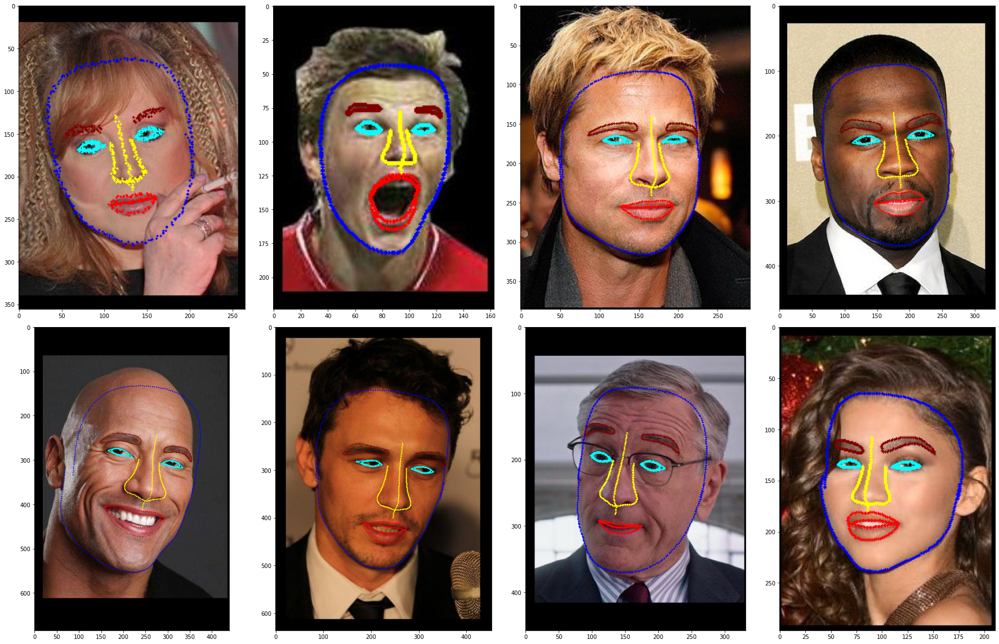
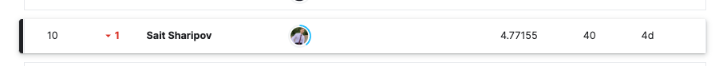

# 🧑🏻‍🦱 Predict (almost!) a thousand facial landmarks using Deep Learning.

## 📝 Description:

* [Kaggle сompetition](https://www.kaggle.com/competitions/vkcv2022-contest-01-facial-landmarks) on the course "Computer vision" at the [Academy of Big Data MADE by VK Education](https://data.vk.company/).  
* Regression of 971 key points/landmarks of the face.
* [GitHub of course](https://github.com/lysukhin/MADE).
* [Video](https://www.youtube.com/watch?v=CBsbo_CYTow&t=2587s) analysis of the solution (2021 year).

### 🗂 Data:

* 🔗 [Link](https://www.kaggle.com/competitions/vkcv2022-contest-01-facial-landmarks/data) to the data.

* **train:** 64,000 images of faces from the VGGFace dataset, the coordinates (x,y) of 971 key points are known for each face.
* **test:** 16,000 images

### 📈 Evaluation metric:
* MSE.

### 🐣 Baseline:
* [Link](https://github.com/Sharrish/predict_thousand_facial_landmarks/tree/main/solution_notebooks) to the start code.

## ✅ Solution:

### 📚 Notebooks:
* My main notebook. The ideas for the solution are indicated inside: 
* A notebook with an example of visualization of key points: 
* A notebook with an examples of augmentations from [Albumentations](https://albumentations.ai/): 

### ⚙️ Model:
* I used an ensemble of models. The final `submit.csv` of the best models were averaged.
* The weights of one of the models (densenet161) are available at the [link](https://disk.yandex.ru/d/Wzs-NODtqpRaIg).

### 🏆 Result:
10th of 66. Top 16%.

### 🌠 Model's work:

* Visualization of the model's work in the photos of my friends:

